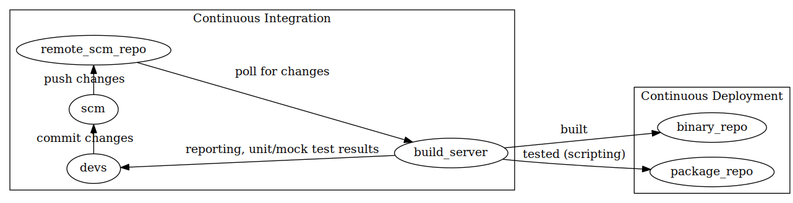
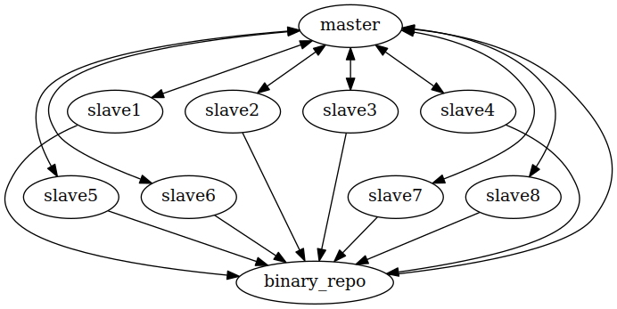
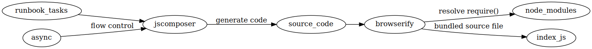

---
# Copyright (C) 2016 Anthony DeDominic
#
# Permission is granted to copy, distribute and/or modify this document
# under the terms of the GNU Free Documentation License, Version 1.3
# or any later version published by the Free Software Foundation;
# with no Invariant Sections, no Front-Cover Texts, and no Back-Cover Texts.
# A copy of the license is included in the section entitled "GNU
# Free Documentation License".

# The build requires the following dependencies:
#    TeXLive
#    pandoc 
#    pandoc-citeproc
---

1. Introduction
===============

Technology is only moving faster.
New industry practices like Continuous Integration and Continuous Deployment, Development Operations and Agile workflow require more consistent automation.
Many tools have been made, but usually come with caveats.
Some have challenges controlling the order of execution, other are coupled to a centralized inventory management service.
However, usually all of them have advantages over shell scripts and other automation tools.

Shell scripting is usually the most natural way of automating operating system provisioning and management.
The shell is usually the most basic UI to control a system.
However, shells are generally not portable.
For instance, some servers may have tools and utilities available that another server does not.
That means a shell script that uses a tool like *sponge* will not work--or at least not in the same way, on machines that do not have *sponge* installed[@jcom].

There are various other problems with shells.
Consider GNU coreutils for Linux distributions, for instance.
These coreutils are basically guaranteed to exist on almost any GNU/Linux distribution.
However, most coreutils tools are built around processing and modifying line oriented data only--tools like: sed, grep, paste, cut, tr, xargs, etc.
Such tools have difficultly working with more modern configuration files or services which leverage complex data structures--for instance, JSON or YAML configuration files[@jcom].
As explained above, leveraging more non-standard tools--tools like jq which process JSON documents for shells, may make the script non-portable.
Portability concerns, and shortfalls in shells and coreutils, have driven developers to create newer tools using scripting languages, like Python.

Ansible is an example of a modern automation tool.
It is built using python, trying to only leverage the python standard library.
However, the moderate complexity and requirements to create and utilize Ansible modules make it difficult to extend it beyond its standard base.
This problem exists because managing foreign dependencies in Python require things like a virtualenv.
One must also include the Ansible library in the module to process the arguments in the module[@ansible].

1.1. Related Works
------------------

### 1.1.1. Ansible

Ansible is one of the most popular tools in the space.
This is because unlike its predecessors, Ansible uses an agentless[^agentless] architecture.
Thus Ansible can work on any GNU/Linux machine running an SSH daemon and have Python 2.x installed.
Ansible, like other tools in the space, uses a playbook to orchestrate what modules to run on what machines.
An inventory file, in an INI file format, tell Ansible what group of servers are associated with a particular label [@ansible].

[^agentless]: Agentless means that when an Ansible playbook is not being executed on a target machine, the machine does not waste resources running Ansible in the background.

### 1.1.2. Puppet

Puppet is a tool that is very similar to Ansible, however puppet is dependent on a backend service--like Foreman, to function properly[@puppet].
For the most part, Ansible is slowly supplanting Puppet from the CI space.
This is due to variety of reasons, primarily because Ansible is agentless[@lessons-ansible].

### 1.1.3. Package Managers

GNU/Linux distributions leverage package management tools to simplify the process of installing applications.
Many of these tools work similar to the above.
They contain files that should be deployed and a runbook to execute what is being installed.

These tools are designed for more generic software installations;
it becomes difficult to leverage package management for more custom software.
Packages can also be older than the newest release, primarily for stability reasons.
They usually deploy very basic configurations and setups that may require modification.
Not only that, but many of these tools require root privileges to function properly; this can greatly hinder users who do not have such privileges, but must deploy certain software.
Package manager packages are usually inflexible about where they install software, generally discouraging local dynamic linking or statically linked binaries.
Package management tools were made prior to more modern continuous integration tools; this usually makes these tools more complex to use.
Probably the largest issue though, is general portability.

Every GNU/Linux distribution, even if they use the same package manager tool, can have wildly different names for the same set of software;
one GNU/Linux distribution could provide postfix as postfix-smtp, another could provided is as postfix-server and another could simply provide it as postfix.

2. Background
=============

This section is concerned with providing more detail on the problem domain being solved with this tool.
It will also briefly describe the technologies which enable this tool to function and why they matter.

2.1. Continuous Integration and Continuous Deployment
-----------------------------------------------------

CICD is the process of accelerating the building, testing and installation of applications to end servers .
In a world where web technology moves fast and new features are ideal, it's critical to go to market fast.
To do this there are two major architectures that are used.

CI, continuous integration is concerned with the development process.
In the realm of continuous integration there is usually a source code repository.
The source code repository is usually technologies like git, svn, cvs or other version and source controlling software.
The idea of the source code repository is to allow for efficient ways to handle code changes and to manage multiple developers working on the same code.

Lastly, there is a server, running software similar to Jenkins CI or Travis CI which can potentially handle many tasks.
At a high level, it is usually used to run a build or test step in, say, a build.gradle, project.json, Makefile or various other build tools[@jenkins].
To enhance tools like Jenkins, there are binary and other code quality scans like SonarQube and others which attempt to find issues outside of the space of unit and mock tests.
Other such triggers, like diff checking, can be used to trigger code reviews for massive revisions of source code[@jenkins-plugins].

Generally, the final stage of Continuous Integration is to notify the developers, or other interested parties, the results of these various tests and builds[@jenkins].
In a full CICD build pipeline, generally there is the process of uploading so called artifacts to a artifact or binary repository.
These binary repositories are more in the realm of continuous delivery.
Figure 1 shows these processes in action



Continuous delivery also has it's share of tools and structure.
One of the first requirements of continuous delivery is having some form of binary repository.
For java based projects, there are things like nexus.
Other languages, like python, have their own packaging sites;
python for instance has PyPI.

In order to deploy these binaries, many tools make use of remote shell protocols[@ansible][@puppet][@jenkins].
Remote shell protocols give tools access to execute the needed steps to get software deployed.
Generally these tools run through scripts which make the machine require the needed binaries and create the needed configurations.
The remote shells are no different than conventional user-controlled shells.

There are various tools and servers that do this; a few examples are Ansible, uDeploy and Puppet.
Ansible uses remote shell protocols, such as secure shell (ssh), to execute a set of instructions written in yaml, generally with the intent of installing some type of software[@ansible].
uDeploy is similar in how it causes change on target machines, using secure shell; however uDeploy generally requires the target machines to be running some kind of daemon; this also means it is not strictly *agentless* like Ansible.

Many POSIX-like systems make use of package management to deliver software.
Packages, like .deb's and .rpm's, are a collection of installation shell scripts, including pre-installation and post-installation, and a binary or source code.
Package managers, as their name implies, also manages these installed binaries, scripts and configurations.
Part of their management requires tracking file locations. This allows for rolling back, upgrading or removal of installed files.

Deployment strategy can be different depending on the available infrastructure.
In an environment with fixed inventory, it might not be ideal to do things like \`make install\` which are hard to reverse.
However in an environment where machines can be spun up at whim, or even automatically, it wouldn't matter as much; in such cases one would simply destroy and create a new machine for every deployment[@lessons-ansible].
In a fixed architecture, it might be ideal to stick to package management solutions for delivering binaries.
This way changes are cleanly tracked and handled using battle-tested tools and technologies.



Figure 2 shows a typical uDeploy setup.
A master server orchestrates actions to be take against numerous machines; 
generally the machines fetch the binaries they need to install from an artifact repository. 
Master can be triggered to action by the CI system as well.

2.2. JavaScript, NodeJS and other Technologies
-----------------------------------------------

JavaScript is a unique language.
Not only is it finding uses as a general scripting language, thanks to run-times like NodeJS, it is also the only language for front-end web development;
this leads to some unique issues.
Web browsers, for instance, provide different application programming interfaces and library functions than NodeJS.
To try to tie the environments together, JavaScript developers built tools and wrappers, called polyfills.

### 2.2.1. JavaScript Modules Systems

One common polyfill found in many JavaScript front-ends is a module system, since web browsers never needed one.
This is because \<script\>\</script\> tags were considered good enough.
However, NodeJS--and the many libraries built for it, utilize a module system since a server would not have these script tags.

To port this advantageous module system to the web, CommonJS was created.
CommonJS, or require.js, is a JavaScript tool that polyfills the require() function available on NodeJS and enabled browsers to have more modular code[^import-ecma6][@browserify].

[^import-ecma6]: As of ECMAScript 6, the *import* semantic is the preferred, universal, module system.

```javascript
// module system in NodeJS, pre import
var module_name = require('module-name')
// new ECMAScript 6 way
import * as module_name from 'module-name'
```

The above shows an example of the module system.

Browserify is a tool that takes CommonJS a step further.
It takes all of these module require() calls, finds NodeJS specific library functions and reserved words, and creates a bundled JavaScript file, with all the polyfills and libraries required, in one source file that can be included using one \<script src="index.bundle.js"\>\</script\> tag.
This completely revolutionized front-end web development as it allowed users to make modules that are truly platform independent.
Combine this with browserify's transformation streams and one can convert and bundle NodeJS source to target other JavaScript engines like GJS--GNOME bindings for JavaScript[@browserify].

The push to create portable JavaScript has evolved the language dramatically.
It had also created a flood of tools and libraries that make it a suitable language to make an automation framework with, like Ansible.

### 2.2.2. JavaScript Backwards Compatibility

Unlike the transition from Python 2.x to Python 3.x, JavaScript ECMA6 and ECMA5 are completely backwards compatible.
The advantage of this is that users of JavaScript do not need to worry about communities splitting by newer JavaScript releases.
Even methods which are considered bad practice, like *with()*--a function from very early versions of JavaScript, are still in the language.

3. Objectives
=============

The primary goal is to build a new Continuous Deployment and Configuration Management tool which rivals tools like Ansible.
The idea is to leverage the strengths of JavaScript, NodeJS and utilities like browserify to accomplish this.
Once a tool is developed, the goal is to build example deployment and configuration management runbooks to determine its suitability.

3.1. Going Further
------------------

### 3.1.1. Easy Modules

AutomateJS should have a system which allows a user to dynamically create or *npm install*[^npm-install] modules.
This is to contrast it from prior works which have more complex dependency mechanisms, making it hard to develop and utilize prior works.

[^npm-install]: This is a command which a user would use to include dependencies from <http://npmjs.com> in a project.

### 3.1.2. Controllable Flow of Execution

Prior works in the space do not offer many constructs to handle execution dependencies.
Many depend on using pre and post execution tasks.
To prevent multiple execution of the same tasks, some use handler mechanisms to notify the framework to execute that step once the main set of tasks are done.
Ideally AutomateJS will allow for users to dictate which collection of modules must occur in order or can occur in parallel.

In order to guarantee a proper flow of execution, many Ansible modules must be put in synchronous mode[@ansible]

4. Results
==========

This section will concern itself with features of the tool, AutomateJS, how it works and how it compares with Ansible.

4.1. Runbooks
-------------

Runbooks are what tell AutomateJS what to do.
They make use of YAML file format;
The advantage of this file format is its human readability over more machine oriented documents like JSON or XML.
Ansible uses the same file format for their playbooks.

### 4.1.1. How it Works

```yaml
name: 'example'
description: 'example runbook'
hosts: ${host}
sudo: true

tasks:
- name: echo1
  echo: ${echo_value}
- name: serial test
  serial:
  - name: copy file
    file:
      source: somefile.files
      destination: '/root/asdf'
      mode: '0400'
      owner: 1003
  - name: shell
    shell: 'cat /root/asdf'
- name: test template
  template:
    source: 'some-template.js'
    destination: '/root/blah'
    mode: '0400'
    owner: 1003
    variables:
      name: 'Anthony'
```

Above is an example runbook.
It shows all of the crucial features and core modules at work.
At a top level, metadata is defined, basically what this runbook does.
The *hosts* value determines what machine or machines this script runs against.
The most important item in the runbook is the *tasks*.
This item contains all of the steps a runbook must execute.
Inside the tasks, each *- name* and *module-name* pair is a single module.
The *name* item is a unique string that identifies the step.
the *module-name*--like shell or file, contain a nested object which are the module's parameters.
The *echo* module's argument shows off another feature of runbooks, templating.
The value of *\${echo_value}* is provided at runtime, allowing the runbook to be more reusable.

### 4.1.2. Comparison to Ansible

```yaml
---
- hosts: webservers
  vars:
    http_port: 80
    max_clients: 200
  remote_user: root
  tasks:
  - name: ensure apache is at the latest version
    yum: name=httpd state=latest
  - name: write the apache config file
    template: src=/srv/httpd.j2 dest=/etc/httpd.conf
    notify:
    - restart apache
  - name: ensure apache is running (and enable it at boot)
    service: name=httpd state=started enabled=yes
  handlers:
    - name: restart apache
      service: name=httpd state=restarted
```

For the most part, runbooks aren't entirely different from the example Ansible playbook shown above[@ansible].
The key difference is that Ansible playbooks can contain different set of tasks to execute for different hosts.
This is why *hosts* item is the top level item of a playbook.

Ansible also shows off more of its features here, such as the handlers and notify objects in the playbook.
This allows separating tasks that are commonly ran multiple times and only execute them once all other tasks are done.
Because AutomateJS has *serial* and *parallel* modules, it doesn't really require such constructs.
Tasks that mutate a service--in this ansible example httpd, can be grouped together in a serial module  with the httpd restart being the last module.

A more complete example[^complete-example] shows off features like *pretask* and *posttask*.
They would also show how ansible uses double curly brackets--*{{var}}*, to template variables into the playbook at runtime.

[^complete-example]: Too large to reasonably include: <https://gist.github.com/marktheunissen/2979474>

Ansible shows off its maturity and completeness in this example.
AutomateJS had some decent advantages, primarily the *serial* and *parallel* module.
Overall though, runbooks have less features than playbooks.

4.2. jscomposer
---------------

The function jscomposer is what generates the code automatejs uses.
Code generation, in this way, better suits how automatejs works.
This is because the code is not executed by the tool, but by the target hosts.

### 4.2.1. How it Works



Figure 3 better shows how AutomateJS makes use of jscomposer and its key importance.
A user's runbook, which is the run.yml file, is converted into a javascript object.
That object is passed into jscomposer, which is a function that returns a source code string.
jscomposer generates code that uses the async[^async-info] library;
this library is what enables AutomateJS to control the execution flow of asynchronous modules.

[^async-info]: see: <https://github.com/caolan/async>

jscomposer uses ECMAScript 6 template strings to convert the runbook tree into a source code.
The source code generator does not insert library or module code in the source; 
it instead inserts *require('module-name')* calls in their place.

Browserify then comes into play, where it parses this generated source code into an abstract syntax tree;
It then finds all the *require()* calls and begins finding the referenced modules and shoves them into the final source code.
The final result is an index.js file which can be executed without any dependencies on any system with NodeJS.

### 4.2.2. Advantages

The advantage jscomposer has over how ansible code generates is that it gives users control on the flow of execution.
To have a similar level a control, you have to use synchronous Ansible modules[@ansible].
Users can use the native jscomposer modules like parallel and serial to dictate strictly how to execute the code.
This is unlike ansible which requires users to use pre, post, tasks and handlers to give a similar benefit.

Below is an example of how one can use jscomposer to create a JavaScript file that will install ezios[^ezios-loc]--a web application available on npm.

[^ezios-loc]: More info at: <https://github.com/GeneralUnRest/ezios>

```yaml
# flow control
# install app example
tasks:
- name: 'install app'
  serial:
  - name: 'create user'
    shell: 'useradd -m ezios'
  - name: 'create db path'
    shell: > 
      mkdir -p /home/ezios/.local/var/db/ezios;
      chown -R ezios /home/ezios/.local;
  - name: 'install app/configs'
    parallel:
    - name: 'install application'
      shell: 'npm install -g ezios'
    - name: 'configure applcation'
      template:
        source: ezios.config.js
        destination: /home/ezios/.mon.js
        variables:
          db_path: '/home/ezios/.local/var/db/ezios'
          api_key: 'a secret key =]'
    - name: 'create service'
      systemd-helper/create:
        service_name: 'ezios'
        description: 'ezios: monitoring tool'
        user: 'ezios'
        exec: '/usr/bin/monjs start'
        service_extra:
        - 'WorkingDirectory=/home/ezios'
  - name: 'start ezios'
    shell: > 
      systemd reload-daemon;
      systemd enable ezios.service;
      systemd start ezios.service
```

Currently, there are limited modules in automatejs which is why the shell module[^on-shell-mod] is used so much.
However, this example demonstrates what can be accomplished with automatejs.
Unlike a pure shell script, for instance, there is no easy mechanism to fill out templates in shells.
This alone makes it superior.
It is also purely asynchronous, so while the configuration is being written, the npm module could be downloading and installing a server application, called ezios.

[^on-shell-mod]: Note that the shell module is highly unlikely to be portable between Windows and GNU/Linux systems, however portable replacements can be made by the community.

Systemd-helper is another module which creates service files.
It was designed to be used as a standalone command-driven module, but because of how simple automatejs's plugin system is, a simple callack function like systemd-helper/create.js can be leveraged directly.

As explained, serial and parallel modules that are built into jscomposer give a higher level control of the flow of execution. 
This allows for crucial tasks, like creating the user and the directory to be done before anything is installed.
Contrast this with the use of pre-tasks and post-tasks in other tools like automatejs.

4.2. automatejs
---------------

AutomateJS is the core user interface for the program.
It composes all the various tools and elements required to create and execute runbooks.
Currently, the tool can take a list of variables, inventory files and a runbook to generate a JavaScript file.
This JavaScript file can then be deployed using ssh to applicable hosts.

However, it lacks many features that Ansible has.
For instance, Ansible can leverage web services for dynamic inventory.
Ansible also has many more advanced features when it comes to protecting information that can be stored in variables and their playbooks.

4.3. Modules
------------

Modules are probably the biggest enhancement over other tools.
Virtually any asynchronous function works with AutomateJS.
Modules are merely functions which accept a JavaScript object of arguments and a callback which has an error parameter and a result value.

```javascript
// basic modules
module.exports = (args, cb) => {
    cb(null, args)
}
```

Above demonstrates a perfectly valid module.
This demonstrates the simplicity of the system.
Ansible requires a little bit more, which requires the program to be aware of an arguments file or must leverage the Ansible python library.

5. Discussion
=============

Like many other tools before it, AutomateJS solves basic automation jobs.

5.1. Related Works
------------------

AutomateJS has a few advantages over other tools in its space.
Being made with composable modules and the power of NodeJS module system.
It also offers a new feature, the ability to control the flow of execution.

Unlike all of the tools in the space, jscomposer allows for AutomateJS to control the order of execution.
Most other tools use pre-tasks, post-tasks and task segregation.
However, this doesn't always work for all dependency related issues.
jscomposer provides features like the serial module which means that the modules in it must be executed in order.
The parallel module does the opposite allowing for tasks to be executed in any order.

In terms of Ansible, AutomateJS makes it easier to create modules.
As shown earlier, to make a valid module, it just has to implement a very basic function.
Unlike Ansible though, AutomateJS does not have a large and encompassing set of standard modules.

Package Managers are generally only limited to common, off the shelf software.
In many cases, a user of AutomateJS may want to install certain software from these tools.

5.2. Limitations
----------------

AutomateJS is lacking in many features.
For instance, it doesn't have a dynamic inventory system like Ansible.
The SSH transport is not as mature as Ansible.
It depends on private key authentication only.
It also doesn't work with sudo when a password is required, primarily because of the overhead of a pseudo-tty garbling output.

AutomateJS does not provide a handler mechanism like many other tools.
Because tasks can be executed in a specific order, the mechanism may not be required.
The other feature it is lacking is nested tasks;
tools like Ansible call these roles, which are basically sub-playbooks with their own variables and modules.

The core modules are also lacking in features.
The file module copies files, but does not give users the ability to set owner or mode of the file.
This could be implemented however.
Because this project has really started, many of the example scripts abuse the shell module, which is not much better than using shell scripts.

Unlike Python, NodeJS is not a common package that comes pre-installed on many Linux or BSD installations.
So unlike Ansible, to utilize AutomateJS, a user must ensure NodeJS is installed on the system.

5.3. Future Work
----------------

Because of the limitations, the next steps are to explore building a wrapper around Ansible.
Because of Ansible's rich features and modules systems, it would be ideal to leverage that instead of re implementing all its features in AutomateJS.

Because AutomateJS does not have roles, a helper tool should be made that can turn a subset of tasks with variables, into a module that can be npm installed or required.

Dynamic inventory should be a simple addition that could be made.
Basically the feature requires the user to provide a binary that takes host label and outputs a json object.

6. Conclusion
=============

Because of the limitations of shells and other OS tools and features, many automation tools were made.
These tools were made to allow for building projects andaccelerated delivery of these projects to back-end services.
AutomateJS adds some unique features over other tools in its space.
It is able to execute a set of commands in a defined order.
It modules use basic NodeJS conventions, making ti very eay to create or adapt prior works to be usable by AutomateJS.
